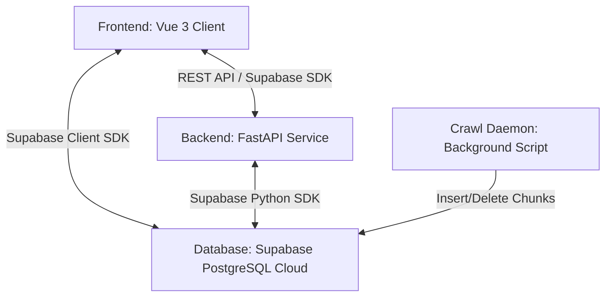
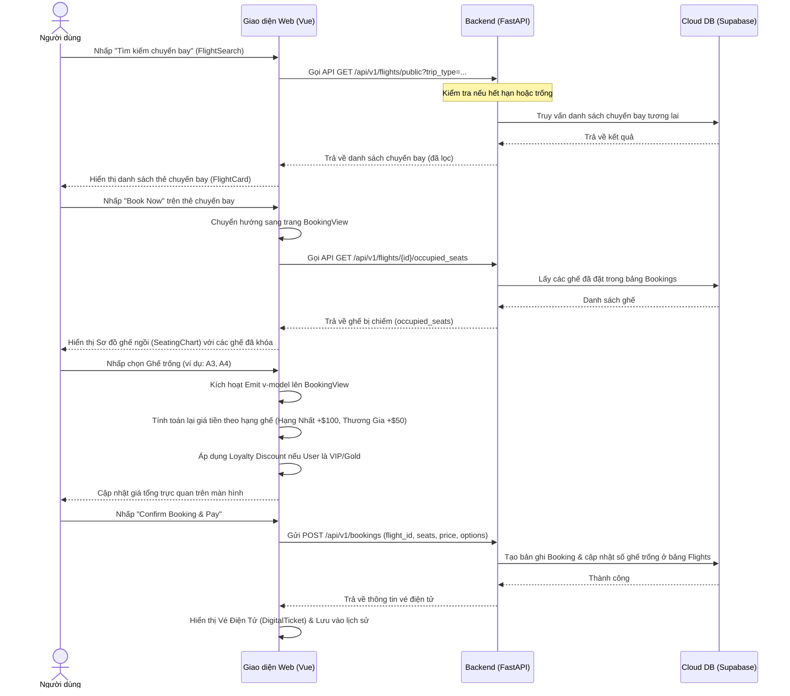

# Tài Liệu Hướng Dẫn Kiến Trúc & Luồng Vận Hành Hệ Thống Flight Booking

Tài liệu này cung cấp một cái nhìn toàn diện, cực kỳ chi tiết về cách hệ thống đặt vé máy bay (**Flight Booking System**) vận hành, cách các component trò chuyện với nhau, luồng di chuyển của dữ liệu, và các kỹ thuật giúp hệ thống luôn hoạt động ổn định và nhất quán.

---

## 1. Tổng Quan Kiến Trúc (Architecture Overview)

Hệ thống được xây dựng theo mô hình **Client - Server - Database Cloud**, đảm bảo tính module hóa và dễ bảo trì:



- **Frontend (Client-side):** Sử dụng **Vue 3** (Single Page Application - SPA) kết hợp với **Vue Router** để điều hướng mượt mà, **Vanilla CSS** tùy biến cao cho giao diện cao cấp, và kết nối trực tiếp với **Supabase JS Client SDK** hoặc qua **FastAPI Backend APIs**.
- **Backend (Server-side):** Sử dụng **FastAPI** (Python) chạy trên máy chủ **Uvicormun**. Đảm nhận xử lý các logic phức tạp như bảo mật, xác thực người dùng, dọn dẹp tự động, và các nghiệp vụ Admin.
- **Database (Cloud):** Sử dụng **Supabase PostgreSQL** trên nền tảng đám mây, giúp lưu trữ dữ liệu tập trung, đảm nhận tính năng đồng bộ thời gian thực và độ tin cậy cao.

---

## 2. Kỹ Thuật Liên Kết & Giao Tiếp Giữa Các Component (Component Communication)

Để truyền tải dữ liệu và đồng bộ trạng thái một cách hiệu quả nhất, hệ thống kết hợp nhiều phương thức giao tiếp khác nhau tùy thuộc vào ngữ cảnh:

### 2.1. Cha-Con qua Props & Custom Events (v-model / Emits)

Đây là cách giao tiếp trực tiếp nhất giữa các component có quan hệ phân cấp.

- **Ví dụ điển hình:** Component `BookingView.vue` chứa component con `SeatingChart.vue`.
- **Cách thức:**
  - **Chiều đi (Props):** Cha truyền thông tin danh sách ghế đã được đặt bởi người khác (`:other-occupied`), ghế người dùng hiện tại đã đặt (`:user-booked`), ghế đang bị khóa (`:locked-seats`), và giá cơ bản (`:base-price`) xuống con.
  - **Chiều về (Emits/v-model):** Khi người dùng nhấp chọn ghế trong sơ đồ `SeatingChart.vue`, component con sẽ gửi thông tin cập nhật danh sách ghế đã chọn (`selectedSeats`) ngược lên cho cha `BookingView.vue` thông qua cơ chế `v-model` (hoặc phát ra event `update:modelValue`). Cha sẽ lập tức tính toán lại tổng tiền dựa trên số ghế mới chọn này.

### 2.2. Giao tiếp qua Router State (Vue Router params & query)

Khi chuyển hướng giữa các trang (ví dụ từ trang tìm kiếm sang trang đặt vé), dữ liệu cần được mang theo.

- **Ví dụ điển hình:** Từ trang tìm chuyến bay `Flights.vue` sang trang đặt vé `BookingView.vue`.
- **Cách thức:**
  - Khi người dùng click "Book Now" trên một `FlightCard.vue`, Vue Router thực hiện chuyển hướng:
    ```javascript
    router.push({
      name: "booking",
      params: { id: flight.id },
      query: { passengerCount: searchParams.passengers },
    });
    ```
  - Tại `BookingView.vue`, component sẽ dùng `this.$route.params.id` để gửi API request lên Backend lấy chi tiết chuyến bay đó, đảm bảo dữ liệu luôn mới nhất từ database mà không sợ lỗi lưu cache cũ.

### 2.3. Trạng Thái Toàn Cục qua LocalStorage & Global Objects

Đối với các dữ liệu cần dùng chung ở mọi nơi như thông tin đăng nhập, phân quyền, và lịch sử phiên làm việc:

- Hệ thống lưu trữ đối tượng đăng nhập hiện tại `currentUser` trong `localStorage`.
- Mỗi khi các component như Navbar, Profile, hay Admin khởi tạo, chúng sẽ đọc trực tiếp từ `localStorage` để quyết định xem có hiển thị các chức năng tương ứng hay không.

---

## 3. Luồng Nghiệp Vụ Chi Tiết Khi Nhấp Chuột (Interactive Click Flows)

Dưới đây là sơ đồ chi tiết biểu diễn hành động của người dùng và phản hồi của hệ thống:

### 3.1. Luồng Tìm Kiếm & Đặt Vé Máy Bay



---

## 4. Các Kỹ Thuật Đảm Bảo Độ Ổn Định & Nhất Quán (Stability & Consistency Techniques)

Hệ thống áp dụng nhiều kỹ thuật tiên tiến để đảm bảo ứng dụng luôn chạy mượt mà, không xảy ra xung đột dữ liệu:

### 4.1. Ngăn Chặn Đặt Trùng Ghế (Double Booking Prevention)

- **Vấn đề:** Hai người dùng cùng vào một chuyến bay và chọn cùng một số ghế tại cùng một thời điểm.
- **Giải pháp:**
  - Trước khi hiển thị sơ đồ ghế, hệ thống lấy dữ liệu trực tiếp từ các booking đã hoàn thành (`status = 'completed'`). Ghế đã mua sẽ bị vô hiệu hóa hoàn toàn thuộc tính click trên giao diện.
  - Tại backend, trước khi lưu hóa đơn đặt vé mới, hệ thống sẽ thực hiện kiểm tra kiểm chứng chéo (Double-check) xem ghế đăng ký có nằm trong tập ghế đã mua của chuyến bay đó chưa. Nếu phát hiện trùng lặp, backend sẽ từ chối giao dịch và báo lỗi, ngăn chặn tối đa việc bán trùng vé.

### 4.2. Cơ Chế "Tự Phục Hồi" Chuyến Bay Khi Hết Hạn (Self-Healing Data)

- Như đã giải thích, khi toàn bộ chuyến bay trong cơ sở dữ liệu đã trôi qua thời gian khởi hành (không còn chuyến bay nào trong tương lai):
  - Hệ thống không báo lỗi trống trơn mà kích hoạt cơ chế **Tự phục hồi** (Auto-generation).
  - API tự động gọi hàm crawl và dọn dẹp các chuyến bay cũ chưa đặt, đồng thời sinh mới đúng 1000 chuyến bay tiếp theo và lưu trực tiếp vào cơ sở dữ liệu đám mây Supabase. Trải nghiệm người dùng không bao giờ bị gián đoạn.

### 4.3. Phân Đoạn Ghi Dữ Liệu Lớn (Chunking Insert Data)

- **Vấn đề:** Chèn đồng thời 1000 bản ghi chuyến bay lớn vào Supabase có thể gây nghẽn kết nối, vượt quá giới hạn payload hoặc timeout của cổng API.
- **Giải pháp:**
  - Trong file `crawl_flights.py` (dòng 120-127), danh sách 1000 chuyến bay được chia nhỏ thành từng đợt chèn (chunks) có kích thước tối đa là 1000 bản ghi.
  - Mỗi chunk được gửi tuần tự để đảm bảo Supabase luôn phản hồi thành công mà không gặp bất kỳ lỗi nghẽn đường truyền nào.

### 4.4. Xử Lý Lỗi Tập Trung & Kháng Lỗi (Graceful Degradation)

- Tất cả các lời gọi API từ Frontend lên Backend hoặc trực tiếp tới Supabase đều được bọc trong cấu trúc `try/catch`.
- **Ví dụ:** Nếu kết nối Internet chập chờn không thể lấy danh sách Sân bay từ database, hàm crawl sẽ tự động nạp các mã sân bay dự phòng (Fallbacks) được khai báo sẵn tại chỗ (ví dụ: SGN, HAN, DAD,...) để tiếp tục tạo chuyến bay thay vì dừng chương trình và văng lỗi.
